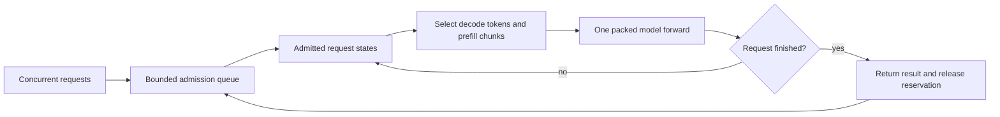
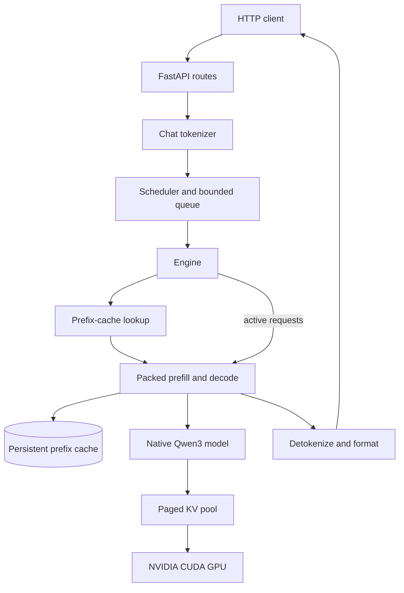

# Helios

Helios is a small, readable inference engine for running
[Qwen3-4B](https://huggingface.co/Qwen/Qwen3-4B) on a local NVIDIA GPU. It
implements the model, weight loading, tokenization, KV caching, generation, and
HTTP serving path directly in PyTorch.

This is an inference-engineering learning project, not a production serving
system. The code favors mechanisms that are easy to inspect and change, not a
broad feature set.

## What is included

- A native PyTorch implementation of Qwen3-4B
- Grouped-query attention, rotary position embeddings, RMS normalization, and
  SwiGLU feed-forward layers
- Native paged attention through PyTorch `varlen_attn`, using a shared pool of
  256-token KV pages
- Hugging Face `tokenizer.json` and safetensor weight loading
- Packed mixed batches that can run decode tokens and prefill chunks in one
  model forward
- Continuous batching of concurrent requests
- Per-request page tables and a persistent prefix cache of 256-token prompt
  blocks
- GPU-memory admission checks and a shared budget for active KV and cached
  prefixes
- A non-streaming OpenAI-style chat completions endpoint
- A concurrent HTTP benchmark with per-request and aggregate timing data

## Requirements

- Python 3.11 or newer
- [uv](https://docs.astral.sh/uv/)
- PyTorch 2.13 or newer
- An Ampere or newer NVIDIA GPU (SM80+) with FP16 or BF16 support, and enough
  memory for Qwen3-4B plus its KV pages
- Internet access on first run to download the model snapshot from Hugging Face

Serving runs on NVIDIA CUDA. Apple Metal and CPU execution are not supported.
Dense KV attention remains in the decoder for tests and as a numerical
reference.

## Quick start

```bash
git clone https://github.com/sidmanale643/helios.git
cd helios
uv sync
uv run helios
```

The first start downloads the tokenizer and model weights. If Hugging Face
requires authentication in your environment, set `HF_TOKEN` before starting
Helios.

After warmup completes, the server listens on `http://127.0.0.1:8000`.

```bash
curl http://127.0.0.1:8000/health
```

The health response includes the loaded model revision, warmed batch sizes,
profiled memory budget, and a scheduler snapshot. Interactive API documentation
is available at [`http://127.0.0.1:8000/docs`](http://127.0.0.1:8000/docs) while
the server is running.

## Chat completions API

Helios implements a focused, non-streaming subset of
`POST /v1/chat/completions`:

```bash
curl http://127.0.0.1:8000/v1/chat/completions \
  --header 'content-type: application/json' \
  --data '{
    "model": "Qwen/Qwen3-4B",
    "messages": [
      {"role": "system", "content": "Answer clearly and briefly."},
      {"role": "user", "content": "Why does a KV cache speed up decoding?"}
    ],
    "temperature": 0.2,
    "top_p": 0.95,
    "max_tokens": 128,
    "stream": false
  }'
```

The response follows the OpenAI chat-completion shape and contains one
assistant choice plus prompt, completion, and total token counts. Cached prompt
tokens are reported in `usage.prompt_tokens_details.cached_tokens`. The Helios
`timings` object reports tokenization, queueing, prefix lookup, restore,
prefill, decode, and cache-store time, together with time to first token,
throughput, and prefix-cache hit rate.

The chat tokenizer applies a fixed Qwen3 template and always opens the assistant
turn with an empty `<think>` block, so the model does not emit a thinking
trace.

Supported request fields:

| Field | Notes |
| --- | --- |
| `model` | Must match the loaded model. The only implemented architecture is Qwen3-4B. |
| `messages` | 1 to 128 `developer`, `system`, `user`, `assistant`, or plain `tool` transcript messages. |
| `max_tokens` | 1 to 2,048. Defaults to 256. `max_completion_tokens` is accepted as an alias. |
| `temperature` | 0 to 2. Defaults to 0.2. |
| `top_p` | Greater than 0 and at most 1. Defaults to 0.95. |
| `stream` | Must be `false`. |

Streaming, OpenAI tool-call objects, structured outputs, authentication, and
the rest of the OpenAI API are not implemented.

### Continuous batching

Clients send ordinary chat-completion requests concurrently. Each scheduler tick
selects one token for every request that is already decoding, then spends the
remaining token budget on unfinished prompts. A prompt that fully fits the
remaining budget is preferred. If a prompt has waited at least 100 milliseconds,
the oldest waiting prompt is taken instead so long prefills still progress.

Selected tokens run in one packed model forward with independent sequence
positions and paged KV mappings. A tick that contains only decode tokens reuses
the decode page-table buffers. A mixed tick still pays for the prefill work in
that forward, so packing does not remove prefill compute from decode latency.

`HELIOS_PREFILL_CHUNK_SIZE` is the shared token budget for one tick, including
decode tokens. If that value is smaller than the number of decoders plus one,
the tick uses the larger limit so both decode and prefill can progress.

Admission is FIFO, bounded by `HELIOS_MAX_BATCH_SIZE` and the shared KV-memory
budget. A request that cannot fit the profiled budget is rejected. A request
that fits the budget, but not the memory currently free, waits at the head of
the queue. Admitted requests keep their KV pages across ticks and finish
independently. Completed prompt blocks can remain in the prefix cache.



Wall-clock time to first token and token intervals include scheduling and
sampling. Compute measurements cover the shared model forward. A mixed batch
duration is added to each participating request's current phase. Those numbers
are not isolated per-request GPU costs, and summing them across requests does
not estimate GPU utilization.

### Paged attention

Serving uses native PyTorch paged attention and shared prefix pages. This
requires PyTorch 2.13 and an Ampere or newer NVIDIA GPU (SM80+) with
FP16 or BF16 weights. A fixed KV pool holds 256-token pages. Each request owns
a page table. Prefill and decode read those pages through PyTorch's
`varlen_attn` without rebuilding a padded batch of K and V tensors. There is no
extra kernel dependency.

Completed prefix pages share the same storage. Helios returns pages to the pool
when their last request or prefix-cache reference is released. Prefix blocks
are 256 tokens, so shorter prefixes are not cached. Admission still reserves
the request's maximum length, rounded up to whole pages, to guarantee space
for decode. Evicting prefix entries frees pages within the pool rather than
returning that backing memory to CUDA.

Decode writes directly to the shared KV pool. CUDA numerical tests require a
compatible GPU. CPU tests exercise a reference attention implementation, not the
CUDA kernel.

## Architecture



At startup, Helios resolves one Hugging Face snapshot for both tokenizer and
model, checks available GPU memory, loads the safetensors into the native Qwen3
implementation, and creates a provisional KV limit. Startup warms the cold
prefill path and the prefix restoration path. It also profiles a fixed
number of decode steps for every batch size from 1 through
`HELIOS_MAX_BATCH_SIZE`, with equal and mixed prompt lengths, including packed
batches at the configured token budget where KV capacity permits. Warmup always
runs that full decode step count, even if the model would have emitted EOS.
Health reports `warmup_batch_sizes`.

Helios measures cold-path and batched decode memory peaks, then sets one shared
budget for active request KV and retained prefix KV. That budget backs one page
pool. Requests with a cached prefix share those physical pages. New tokens use
private pages. Helios reuses pages after the last request and prefix-cache
reference releases them.

For a single request, the tokenizer applies the Qwen3 chat template. Helios
hashes complete 256-token prompt blocks, restores the longest cached chain of
pages, prefills only unmatched tokens, and then decodes. Completed prompt
blocks can be retained for later requests. Cache entries have a sliding TTL and
are evicted when active KV needs space, preferring unused leaf blocks over
parents that later blocks still depend on.

Every request must fit the model context window and the shared KV budget. New
prompts join active decoding when a request slot and memory are available.

After a forward that produces logits for ready requests, Helios copies sampled
tokens to the CPU for EOS and completion checks. CUDA events measure forward
time without a device-wide
wait. Greedy sampling runs across all ready rows together. Rows that share one
temperature and top-p are sampled together. Mixed sampling settings fall back
to per-row sampling.

On NVIDIA GPUs, prefill and decode run causal paged attention. They read K and
V through page tables and do not gather shared prefixes into dense request
caches.

## Diagnostics and logs

`GET /internal/cache` returns the process-local prefix-cache block count, token
count, memory use, capacity, hashes, and hit counts. It is an unprotected
diagnostic endpoint, so do not expose it on an untrusted network.

The server logs request IDs and execution events without logging prompt or
generated text. Useful events include FIFO admissions, active decode
membership, memory or slot admission blocks, prefix-cache hits and stores,
completion, rejection, and failure.

## Configuration

Helios loads a local `.env` file automatically.

| Variable | Default | Purpose |
| --- | --- | --- |
| `HELIOS_MODEL_ID` | `Qwen/Qwen3-4B` | Model repository. No other architecture is currently implemented. |
| `HELIOS_MODEL_REVISION` | latest resolved snapshot | Pins tokenizer and model files to a Hugging Face revision. |
| `HF_TOKEN` / `HF_API_KEY` | unset | Hugging Face authentication. |
| `HELIOS_MAX_GPU_UTILIZATION` | `0.90` | Fraction of total GPU memory available to model residency, activation reserve, and KV state. |
| `HELIOS_WEIGHT_HEADROOM_RATIO` | `0.20` | Additional free-memory requirement before loading weights. |
| `HELIOS_KV_CACHE_HEADROOM_RATIO` | `0.20` | Safety margin above measured warmup activation memory. |
| `HELIOS_PREFIX_CACHE_TTL_SECONDS` | `300` | Sliding lifetime of a cached prompt block. |
| `HELIOS_PREFILL_CHUNK_SIZE` | `256` | Shared prefill and decode token budget per tick. At least one token per decoder plus one for prefill. |
| `HELIOS_MAX_BATCH_SIZE` | `8` | Maximum number of concurrently active continuous requests. |
| `HELIOS_MAX_QUEUE_SIZE` | `32` | Maximum number of waiting jobs. Excess work receives HTTP 503. |
| `HELIOS_BATCH_WAIT_MS` | `2` | Initial admission window after the first queued request arrives. |

Set `HELIOS_MAX_BATCH_SIZE=1` to serialize ordinary requests while retaining the
queue. More active slots can improve aggregate throughput, but KV memory and
decode cost also grow. Benchmark on the target GPU and workload.

## Benchmarks

Start Helios in one terminal, then run the concurrent HTTP benchmark from a
second terminal:

```bash
# Terminal 1
uv run helios

# Terminal 2
uv run python benchmarks/run.py --label continuous-batch
uv run python benchmarks/run.py --label continuous-batch --concurrency 16
```

The runner expects a local `dataset.json` at the repo root. JSON files are
gitignored, so you supply this file yourself. The runner validates the dataset,
checks server health, sends one isolated post-health warmup, and then submits
dataset requests concurrently. The server scheduler forms the continuous
batches. The benchmark client does not. Responses are printed as they finish.
Results are written to `benchmarks/results/` with raw per-request timings and
aggregate elapsed time and output throughput.

Use `--dataset /path/to/dataset.json` for another versioned request set and
`--base-url` or `HELIOS_BASE_URL` for a remote server. See
[`benchmarks/README.md`](benchmarks/README.md) for the dataset schema and
protocol.

## Tests

```bash
uv run python -m unittest discover -s tests
```

CUDA tests skip when no compatible GPU is present. CPU tests cover paged-cache
bookkeeping, mixed-batch scheduling, and a reference attention implementation.
They do not run the CUDA `varlen_attn` kernel.

## Project structure

```text
src/helios/
├── api/                 # FastAPI routes, request schemas, and dependencies
├── runtime/
│   ├── qwen3/           # Model, layers, dense KV, paged KV, and decoding
│   ├── engine.py        # Admission, mixed-batch ticks, and request lifecycle
│   ├── frontend.py      # Chat tokenization, warmup, health, and responses
│   ├── generate.py      # Prefix-cache generation and page-pool setup
│   ├── prefix_cache.py  # Hashed 256-token prompt blocks
│   ├── scheduler.py     # Bounded FIFO queue and worker thread
│   ├── warmup.py        # Decode and packed-batch memory profiling
│   └── worker.py        # Hugging Face tokenizer snapshot
├── config.py            # Environment-backed runtime configuration
└── main.py              # Uvicorn entry point
benchmarks/              # Concurrent HTTP benchmark runner
tests/                   # Unit tests for batching, paging, and decode
```

## Current scope

Helios keeps serving small and inspectable. It does not provide streaming,
quantization, multi-model serving, distributed execution, custom CUDA kernels,
or production controls such as authentication and rate limiting.

Continuous batching can pack prefill chunks with active decode in one forward.
Native paged attention shares prefix pages. A dense KV path remains for tests.

The goal is to keep a correct, understandable baseline for each mechanism and
measure the effect before adding the next optimization.

## Acknowledgements

- [Qwen3-4B](https://huggingface.co/Qwen/Qwen3-4B) for the model weights and tokenizer
- [LLMs from Scratch: Qwen3](https://github.com/rasbt/LLMs-from-scratch/tree/main/ch05/11_qwen3) for a readable architecture reference
- [PyTorch](https://pytorch.org/) and [FastAPI](https://fastapi.tiangolo.com/)

## License

Helios is released under the [Apache License 2.0](LICENSE).
