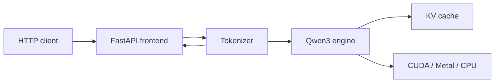

# Helios

Helios is a small, readable inference engine for running
[Qwen3-4B](https://huggingface.co/Qwen/Qwen3-4B) locally. It implements the
model architecture and generation loop in PyTorch, including grouped-query
attention, rotary embeddings, autoregressive decoding, and a KV cache.

The project is built for learning and experimentation: the code favors explicit
inference mechanics over framework abstractions. Helios is not a production
serving system yet.

## Highlights

- Native Qwen3-4B implementation with Hugging Face safetensor loading
- CUDA, Apple Metal, and CPU device selection
- Memory admission before weight loading and KV-cache sizing after loading
- Prompt prefill followed by cached token-by-token decoding
- FastAPI frontend with an OpenAI-style HTTP API
- A single in-process tokenizer and model runtime
- Repeatable benchmarks with latency, TTFT, inter-token latency, and throughput

## Architecture

Helios runs the HTTP API, tokenizer, and model runtime in one local process:



The API owns tokenization, detokenization, validation, model execution, and KV
cache management. Generations are serialized in-process because the runtime
uses mutable KV-cache state.

## Requirements

- Python 3.11 or newer
- [uv](https://docs.astral.sh/uv/)
- Enough memory for Qwen3-4B weights and a KV cache
- Internet access on the first run to download the model snapshot

Helios uses float16 on CUDA and Metal and float32 on CPU. Startup is refused if
the model and configured memory headroom do not fit on the selected device.

## Quick start

```bash
git clone https://github.com/sidmanale643/helios.git
cd helios
uv sync
uv run helios
```

The first run downloads the model and tokenizer from Hugging Face. Set
`HF_TOKEN` if your Hugging Face environment requires authentication.

`uv run helios` loads the model, then serves the API at
`http://127.0.0.1:8000`.

Check readiness:

```bash
curl http://127.0.0.1:8000/health
```

Interactive API documentation is available at
[`http://127.0.0.1:8000/docs`](http://127.0.0.1:8000/docs).

## API

### OpenAI-style chat completions

Helios implements a small, non-streaming subset of `POST /v1/chat/completions`:

```bash
curl http://127.0.0.1:8000/v1/chat/completions \
  --header 'content-type: application/json' \
  --data '{
    "model": "Qwen/Qwen3-4B",
    "messages": [
      {"role": "system", "content": "Answer clearly and briefly."},
      {"role": "user", "content": "Why is the sky blue?"}
    ],
    "temperature": 0.2,
    "max_tokens": 128,
    "stream": false
  }'
```

The endpoint returns an OpenAI-style response with one assistant choice and
prompt, completion, and total token counts. Streaming and tool calls are not
implemented.

## Python usage

Use the tokenizer frontend directly:

```python
from helios.config import get_config
from helios.runtime.engine import Engine
from helios.runtime.frontend import TextGenerator
from helios.runtime.types import GenerateRequest
from helios.runtime.worker import Tokenizer

config = get_config()
generator = TextGenerator(Tokenizer.load(config), Engine(config))

response = generator.run(
    GenerateRequest(
        text="Explain solar power simply.",
        sampling={"temperature": 0.2, "max_new_tokens": 128},
    )
)
print(response)
```

For an editable multi-prompt example, update `prompts` in `run_batch.py` and
run:

```bash
uv run python run_batch.py
```

Only one generation runs at a time to protect the mutable model cache.

## Configuration

Helios loads `.env` automatically and supports the following environment
variables:

| Variable | Default | Purpose |
| --- | --- | --- |
| `HELIOS_MODEL_ID` | `Qwen/Qwen3-4B` | Model repository. The native runtime currently supports only this architecture. |
| `HELIOS_MODEL_REVISION` | latest resolved snapshot | Pin the tokenizer and model to one Hugging Face revision. |
| `HF_TOKEN` / `HF_API_KEY` | unset | Hugging Face authentication token. |
| `HELIOS_WEIGHT_HEADROOM_RATIO` | `0.20` | Extra free-memory ratio required before loading weights. |
| `HELIOS_KV_CACHE_HEADROOM_RATIO` | `0.20` | Memory reserved when sizing the KV cache after model loading. |

Both headroom ratios must be at least `0` and less than `1`.

## Benchmarks

Record a repeatable benchmark:

```bash
uv run python benchmarks/run.py --name decode-128
```

Each run warms up the model, measures a fixed prompt suite, writes environment
and timing metadata under `benchmarks/results/`, and compares the result with
the latest equivalent run. See [benchmarks/README.md](benchmarks/README.md) for
the measurement protocol and workload options.

## Project layout

```text
src/helios/
├── api/                 # FastAPI application, routes, and HTTP types
├── runtime/
│   ├── qwen3/           # Model, layers, tokenizer, weights, and KV cache
│   ├── frontend.py      # CPU text frontend
│   ├── generate.py      # Generation runtime
│   └── engine.py        # In-process model runtime
├── config.py            # Environment-backed runtime policy
└── main.py              # Local server
benchmarks/              # Reproducible benchmark runner and results
run_batch.py             # Editable Python batch example
```

## Scope

Helios intentionally starts from a compact, correct baseline before adding
serving complexity. Continuous batching, paged attention, quantization,
streaming, and optimized kernels are outside the current implementation.

## Acknowledgements

- [Qwen3-4B](https://huggingface.co/Qwen/Qwen3-4B) for the model weights and tokenizer
- [LLMs from Scratch: Qwen3](https://github.com/rasbt/LLMs-from-scratch/tree/main/ch05/11_qwen3) for a readable architecture reference
- [PyTorch](https://pytorch.org/) and [FastAPI](https://fastapi.tiangolo.com/)

## License

This repository does not currently include a license. Until one is added, the
code is not granted for reuse or redistribution.
