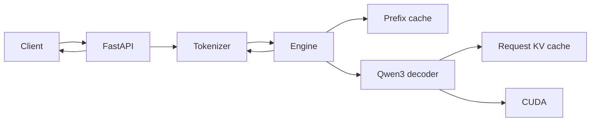

# Helios

Helios is a small, readable inference engine for running
[Qwen3-4B](https://huggingface.co/Qwen/Qwen3-4B) on a local NVIDIA GPU. It
implements the model, weight loading, tokenization, generation loop, KV cache,
and HTTP serving path directly in PyTorch.

The project is an inference-engineering learning environment. It favors code
that is easy to inspect and change over production features or maximum
throughput.

## What is included

- A native PyTorch implementation of Qwen3-4B
- Grouped-query attention, rotary position embeddings, RMS normalization, and
  SwiGLU feed-forward layers
- Hugging Face tokenizer and safetensor loading
- Autoregressive generation with a request-local KV cache
- Reuse of completed prompt blocks through a persistent prefix cache
- Memory checks before model loading and KV-cache sizing after loading
- A non-streaming OpenAI-style chat completions endpoint
- Repeatable benchmarks for latency, TTFT, inter-token latency, and throughput

## Requirements

- Python 3.11 or newer
- [uv](https://docs.astral.sh/uv/)
- A CUDA-capable NVIDIA GPU with enough memory for Qwen3-4B and its KV cache
- Internet access on first run to download the model snapshot from Hugging Face

Apple Metal and CPU execution are not supported by the current loader.

## Quick start

```bash
git clone https://github.com/sidmanale643/helios.git
cd helios
uv sync
uv run helios
```

The first start downloads the tokenizer and model weights. If Hugging Face
requires authentication in your environment, set `HF_TOKEN` before starting
Helios.

Once the model is loaded, the server listens on `http://127.0.0.1:8000`.

```bash
curl http://127.0.0.1:8000/health
```

Interactive API documentation is available at
[`http://127.0.0.1:8000/docs`](http://127.0.0.1:8000/docs) while the server is
running.

## Chat completions API

Helios implements a focused, non-streaming subset of
`POST /v1/chat/completions`:

```bash
curl http://127.0.0.1:8000/v1/chat/completions \
  --header 'content-type: application/json' \
  --data '{
    "model": "Qwen/Qwen3-4B",
    "messages": [
      {"role": "system", "content": "Answer clearly and briefly."},
      {"role": "user", "content": "Why does a KV cache speed up decoding?"}
    ],
    "temperature": 0.2,
    "top_p": 0.95,
    "max_tokens": 128,
    "stream": false
  }'
```

The response uses the OpenAI chat-completion shape and includes one assistant
choice plus prompt, completion, and total token counts. Reused prefix-cache
tokens are reported in `usage.prompt_tokens_details.cached_tokens`. The
Helios-specific `timings` object reports tokenization, queue, cache lookup,
restore, prefill, decode, and cache-store durations.

Supported request fields:

| Field | Notes |
| --- | --- |
| `model` | Must be `Qwen/Qwen3-4B`. |
| `messages` | 1–128 `developer`, `system`, `user`, `assistant`, or plain `tool` transcript messages. |
| `max_tokens` | 1–2,048; defaults to 256. `max_completion_tokens` is accepted as an alias. |
| `temperature` | 0–2; defaults to 0.2. |
| `top_p` | Greater than 0 and at most 1; defaults to 0.95. |
| `stream` | Must be `false`. |

Streaming, tool calls, structured outputs, authentication, and the rest of the
OpenAI API are not implemented.

## Request logs

The server terminal reports each request without logging prompt or generated
text. Every line carries the same `request_id` across these events:

- `request_received` when the API accepts the request.
- `request_queued` when another generation owns the model lock.
- `request_running` with prompt size, output limit, and queue time.
- `prefix_cache` with `status=hit|miss` and the cached-token count.
- `generation_progress` after the first token and every 32 tokens thereafter.
- `prefix_cache_store` after completed prompt blocks are stored.
- `request_completed` with finish reason, token counts, model TTFT, throughput, and total time.
- `request_failed` or `request_rejected` when processing does not complete.

## Python usage

The same runtime can be called without HTTP:

```python
from helios.config import get_config
from helios.runtime.engine import Engine
from helios.runtime.frontend import TextGenerator
from helios.runtime.types import GenerateRequest
from helios.runtime.worker import Tokenizer

config = get_config()
generator = TextGenerator(Tokenizer.load(config), Engine(config))

text = generator.run(
    GenerateRequest(
        text="Explain speculative decoding in simple terms.",
        sampling={"temperature": 0.2, "max_new_tokens": 128},
    )
)
print(text)
```

For a small multi-prompt example:

```bash
uv run python run_batch.py
```

## How it works



At startup, Helios resolves one Hugging Face snapshot for both the tokenizer
and model, checks GPU memory, loads the safetensors into the native Qwen3
implementation, and estimates a provisional KV-cache token limit.
Startup runs a fixed base prompt followed by an extended conversation to warm
both cold and cached-prefix execution (and compile them when enabled). It then
clears the prefix cache and repeats the base prompt to measure peak memory on the
warmed cold path. Each request generates up to four greedy tokens. After cleanup,
the warmed model residency and an activation allowance are subtracted from the
configured GPU-memory ceiling to set one shared budget for active request KV and
retained prefix KV. The prefix cache evicts least-recently-used blocks before a
request or block admission would exceed that budget. No warmup prefixes remain
when serving starts. The activation estimate covers the warmup shape, not every
possible prompt length.

For each request, the tokenizer applies the Qwen3 chat template. The engine
looks up the longest complete cached prompt prefix, restores its per-layer K/V
state, prefills only the unmatched tokens, and then decodes one token at a time.
A process-local lock serializes generation because the decoder owns mutable
cache state.

## Configuration

Helios loads a local `.env` file automatically.

| Variable | Default | Purpose |
| --- | --- | --- |
| `HELIOS_MODEL_ID` | `Qwen/Qwen3-4B` | Model repository. No other architecture is currently supported. |
| `HELIOS_MODEL_REVISION` | latest resolved snapshot | Pins model and tokenizer files to a Hugging Face revision. |
| `HF_TOKEN` / `HF_API_KEY` | unset | Hugging Face authentication. |
| `HELIOS_TORCH_COMPILE` | `0` | Set to `1`, `true`, or `yes` to compile the model with dynamic shapes on first use. |
| `HELIOS_MAX_GPU_UTILIZATION` | `0.90` | GPU-memory ceiling used to budget the warmed model, measured activation reserve, active request KV, and retained prefix KV. |
| `HELIOS_WEIGHT_HEADROOM_RATIO` | `0.20` | Additional free-memory requirement before weight loading. |
| `HELIOS_KV_CACHE_HEADROOM_RATIO` | `0.20` | Extra safety above the measured warmup peak; also used for provisional pre-warmup sizing. |
| `HELIOS_PREFIX_CACHE_TTL_SECONDS` | `300` | Sliding lifetime of each cached prompt block; a cache hit refreshes it. |

Both headroom ratios must be at least `0` and less than `1`.
GPU utilization must be greater than `0` and at most `1`.
The prefix-cache TTL must be finite and greater than `0`.

## Benchmarks

Run the fixed multi-workload suite and save a comparable baseline:

```bash
# Terminal 1: load the model and keep Helios running.
uv run helios

# Terminal 2: call the running server.
uv run python benchmarks/run.py --label baseline
```

The suite covers long-prefill, long-decode, balanced, and a growing simulated
tool-agent transcript with prefix reuse. The benchmark client never loads or
stops the model. Results are written to
`benchmarks/results/` with the model revision, Git state, host, accelerator, raw
samples, and aggregate metrics. Equivalent runs are compared automatically.

See [benchmarks/README.md](benchmarks/README.md) for the protocol and options.

## Project structure

```text
src/helios/
├── api/                 # FastAPI routes, schemas, and dependencies
├── runtime/
│   ├── qwen3/           # Model, layers, tokenizer, weights, decoding, and KV cache
│   ├── engine.py        # Serialized model execution
│   ├── frontend.py      # Text and chat frontend
│   ├── generate.py      # Prefill, decode, and prefix-cache orchestration
│   └── prefix_cache.py  # Hashed prompt blocks and cached K/V snapshots
├── config.py            # Environment-backed runtime configuration
└── main.py              # Local server entry point
benchmarks/              # Repeatable performance runner
run_batch.py             # Direct Python example
```

## Current scope

Helios deliberately keeps the serving design small. It does not currently
provide continuous batching, streaming, paged attention, quantization,
multi-model serving, distributed execution, optimized custom kernels, or a
capacity-bounded prefix-cache policy.

The goal is to make each inference mechanism understandable, verify it against
a simple baseline, and measure the effect before adding the next optimization.

## Acknowledgements

- [Qwen3-4B](https://huggingface.co/Qwen/Qwen3-4B) for the model weights and tokenizer
- [LLMs from Scratch: Qwen3](https://github.com/rasbt/LLMs-from-scratch/tree/main/ch05/11_qwen3) for a readable architecture reference
- [PyTorch](https://pytorch.org/) and [FastAPI](https://fastapi.tiangolo.com/)

## License

This repository does not currently include a license. The source is publicly
visible, but no permission to use, modify, or redistribute it is granted until
a license is added.
